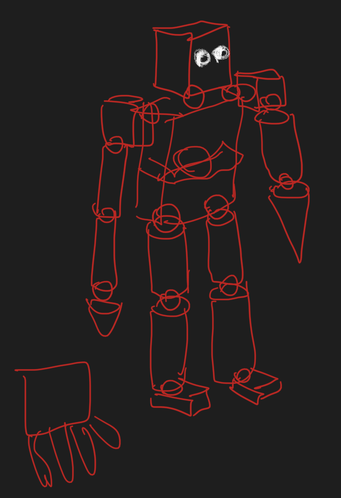
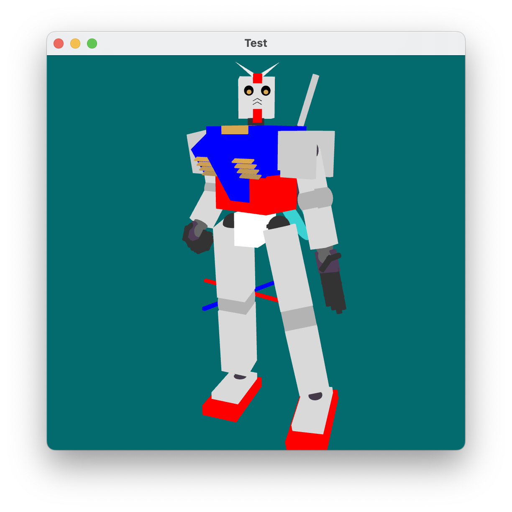
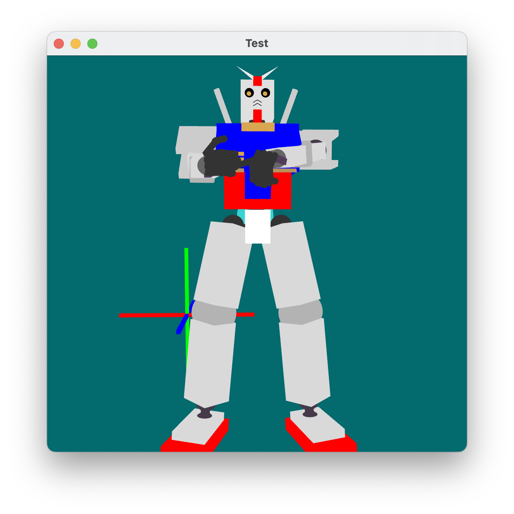
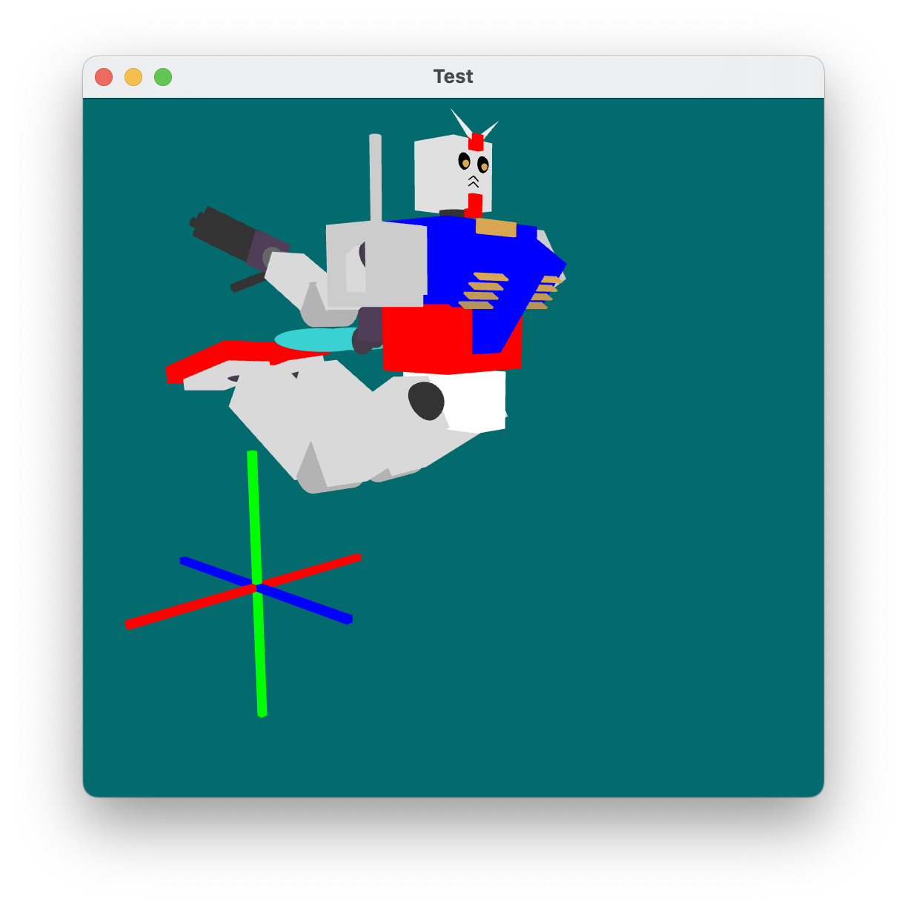
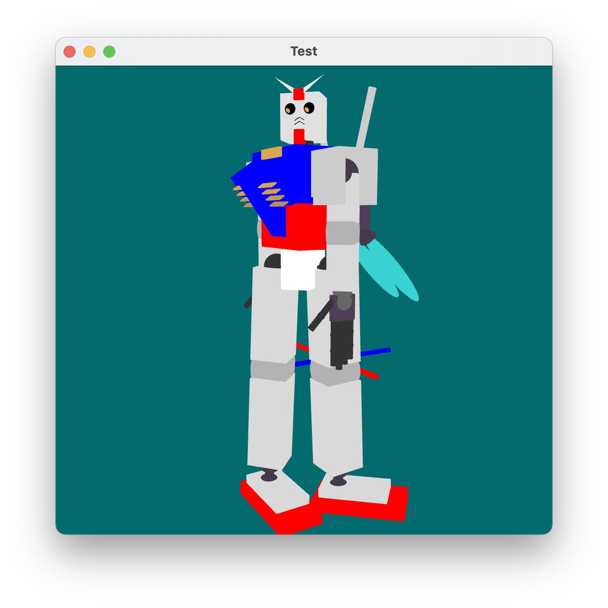
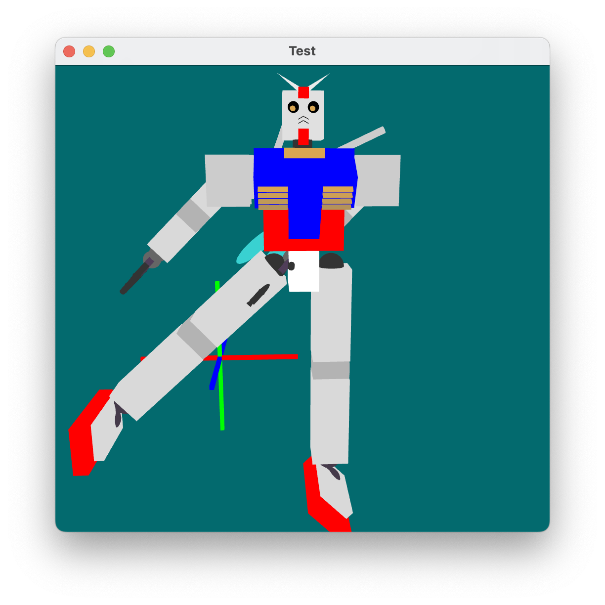
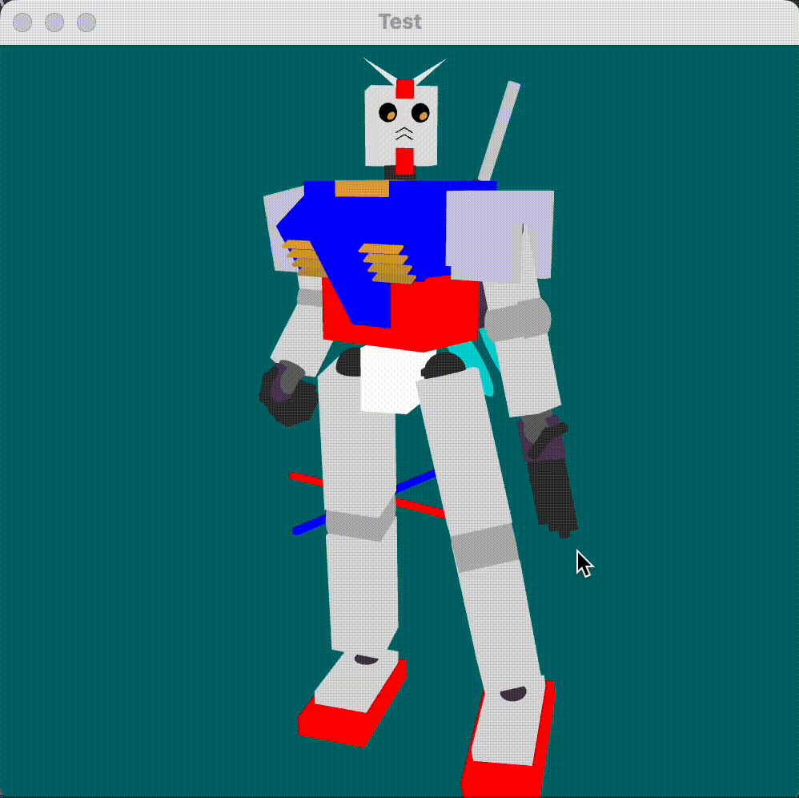

# CS680 3D modeling and model transformation

Student Name: `Zhenghang Yin`
BUID: `U82871437`

In this PA, I using 3D modeling and model transformation, built a model and make it move by performing transformations on its joints, a RX-78-2 gundam's simplified version.

In this program, five preset pose was included, by pressing key 1 - 5. And the support of eye moving was also added.

### Original Sketch

### Poses (Key 1 - 5)

1. Gundam default standing position

   

2. Gundam aiming with gun action (gun model is not implemented)

   

3. All components attempt U-axis rotation

   

4. All components attempt W-axis rotation

   

5. All components attempt V-axis rotation

   

### Eyecatching

